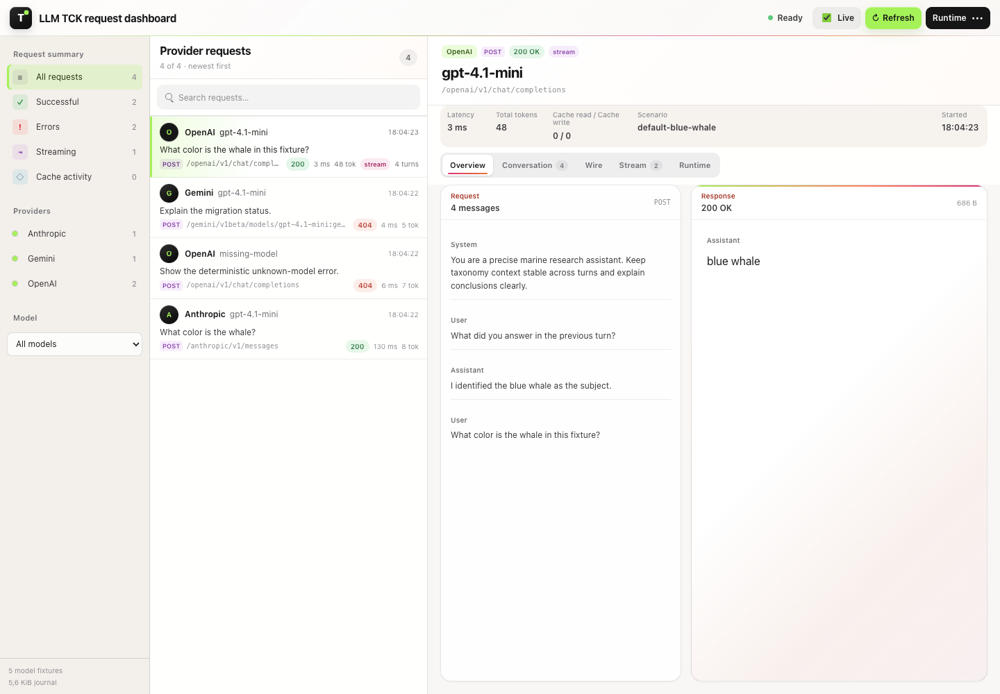
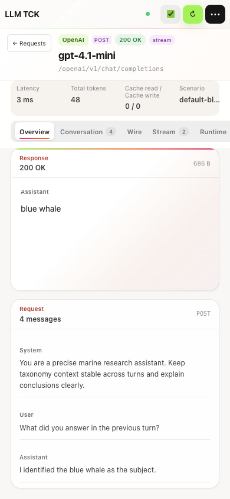

# LLM Technology Compatibility Kit 

`ManagedCode.LlmTck` is a deterministic Technology Compatibility Kit for LLM APIs.
It gives tests a local provider-compatible server that can be hosted by Aspire,
scripted with explicit scenarios, and called through regular HTTP, official SDKs,
or `Microsoft.Extensions.AI`.

The hosted surface is provider-namespaced. OpenAI-compatible routes live under
`/openai`, Azure OpenAI under `/azure-openai`, Microsoft Foundry under
`/microsoft-foundry`, Anthropic Messages under `/anthropic`, and every other
provider family uses its own namespace. Provider packages carry doc-backed API
contracts, and `ManagedCode.LlmTck.Hosting` only claims routes that are mapped by
`MapLlmTck()` and covered by tests.

Use it when a test needs to prove what an application sends to an LLM provider,
script deterministic provider responses, exercise retry/error/model-routing paths,
or assert that no unexpected LLM calls occurred. When a bearer token is configured,
both provider endpoints and `/admin-api/*` control endpoints require it.

## Request Dashboard

The Blazor dashboard at `/` is an operator-focused request inbox. It keeps provider,
model, status, latency, token/cache usage, multi-turn context, sanitized wire payloads,
stream chunks, and the deterministic runtime result together for each request.


| Conversation timeline | Runtime diagnostics |
| --- | --- |
|  |  |

## Packages

| Package | NuGet | Description |
| --- | --- | --- |
| [`ManagedCode.LlmTck`](https://www.nuget.org/packages/ManagedCode.LlmTck) | [](https://www.nuget.org/packages/ManagedCode.LlmTck) | Provider-neutral scenario runtime and assertion state. |
| [`ManagedCode.LlmTck.OpenAI`](https://www.nuget.org/packages/ManagedCode.LlmTck.OpenAI) | [](https://www.nuget.org/packages/ManagedCode.LlmTck.OpenAI) | OpenAI-compatible wire contracts. |
| [`ManagedCode.LlmTck.AzureOpenAI`](https://www.nuget.org/packages/ManagedCode.LlmTck.AzureOpenAI) | [](https://www.nuget.org/packages/ManagedCode.LlmTck.AzureOpenAI) | Azure OpenAI compatibility profile and future wire contracts. |
| [`ManagedCode.LlmTck.Foundry`](https://www.nuget.org/packages/ManagedCode.LlmTck.Foundry) | [](https://www.nuget.org/packages/ManagedCode.LlmTck.Foundry) | Microsoft Foundry compatibility profile and future wire contracts. |
| [`ManagedCode.LlmTck.Anthropic`](https://www.nuget.org/packages/ManagedCode.LlmTck.Anthropic) | [](https://www.nuget.org/packages/ManagedCode.LlmTck.Anthropic) | Anthropic Messages compatibility profile and wire contracts. |
| [`ManagedCode.LlmTck.Gemini`](https://www.nuget.org/packages/ManagedCode.LlmTck.Gemini) | [](https://www.nuget.org/packages/ManagedCode.LlmTck.Gemini) | Gemini compatibility profile and future wire contracts. |
| [`ManagedCode.LlmTck.Groq`](https://www.nuget.org/packages/ManagedCode.LlmTck.Groq) | [](https://www.nuget.org/packages/ManagedCode.LlmTck.Groq) | Groq compatibility profile and future wire contracts. |
| [`ManagedCode.LlmTck.Mistral`](https://www.nuget.org/packages/ManagedCode.LlmTck.Mistral) | [](https://www.nuget.org/packages/ManagedCode.LlmTck.Mistral) | Mistral compatibility profile and future wire contracts. |
| [`ManagedCode.LlmTck.Ollama`](https://www.nuget.org/packages/ManagedCode.LlmTck.Ollama) | [](https://www.nuget.org/packages/ManagedCode.LlmTck.Ollama) | Ollama compatibility profile and future wire contracts. |
| [`ManagedCode.LlmTck.Cohere`](https://www.nuget.org/packages/ManagedCode.LlmTck.Cohere) | [](https://www.nuget.org/packages/ManagedCode.LlmTck.Cohere) | Cohere compatibility profile and future wire contracts. |
| [`ManagedCode.LlmTck.Bedrock`](https://www.nuget.org/packages/ManagedCode.LlmTck.Bedrock) | [](https://www.nuget.org/packages/ManagedCode.LlmTck.Bedrock) | Amazon Bedrock compatibility profile and future wire contracts. |
| [`ManagedCode.LlmTck.OpenRouter`](https://www.nuget.org/packages/ManagedCode.LlmTck.OpenRouter) | [](https://www.nuget.org/packages/ManagedCode.LlmTck.OpenRouter) | OpenRouter compatibility profile and future wire contracts. |
| [`ManagedCode.LlmTck.DeepSeek`](https://www.nuget.org/packages/ManagedCode.LlmTck.DeepSeek) | [](https://www.nuget.org/packages/ManagedCode.LlmTck.DeepSeek) | DeepSeek compatibility profile and future wire contracts. |
| [`ManagedCode.LlmTck.Perplexity`](https://www.nuget.org/packages/ManagedCode.LlmTck.Perplexity) | [](https://www.nuget.org/packages/ManagedCode.LlmTck.Perplexity) | Perplexity compatibility profile and future wire contracts. |
| [`ManagedCode.LlmTck.Hosting`](https://www.nuget.org/packages/ManagedCode.LlmTck.Hosting) | [](https://www.nuget.org/packages/ManagedCode.LlmTck.Hosting) | ASP.NET Core endpoint mapping. |
| [`ManagedCode.LlmTck.Client`](https://www.nuget.org/packages/ManagedCode.LlmTck.Client) | [](https://www.nuget.org/packages/ManagedCode.LlmTck.Client) | Control client plus `IChatClient`, `IEmbeddingGenerator<string, Embedding<float>>`, and `IImageGenerator` implementations. |
| [`ManagedCode.LlmTck.Aspire`](https://www.nuget.org/packages/ManagedCode.LlmTck.Aspire) | [](https://www.nuget.org/packages/ManagedCode.LlmTck.Aspire) | Aspire AppHost extension methods. |

## Current Functionality

This is the currently implemented behavior, not future intent:

| Surface | What works now |
| --- | --- |
| Hosting | `builder.Services.AddLlmTck(...)` registers one deterministic runtime; `app.MapLlmTck()` maps the Blazor server-side browser panel at `/`, JSON control endpoints under `/admin-api`, and provider-namespaced HTTP routes. |
| Runtime configuration | Configure at host startup, through `LlmTckClient.ConfigureAsync(...)`, or through `POST /admin-api/configure`. Configuration replaces the current runtime state and resets assertions, scenario positions, fault counters, and prompt-cache entries. |
| Reset | `ResetAsync()` and `POST /admin-api/reset` keep the current models/scenarios/fixtures but clear assertion events, scenario response positions, rate-limit counters, and prompt-cache entries. |
| Models | Default models use official fixture IDs for chat, embeddings, images, audio, and video. Typed helpers register broader OpenAI model families, and `AddModel(...)` supports custom deployment or provider IDs. Model kind is enforced on every route. |
| Chat scenarios | Contains matching, exact prompt matching, queued responses, streaming chunks, scripted errors, delayed responses, cancellation-safe queues, and scenario-specific bearer tokens are implemented. |
| Modalities | Chat, embeddings, image generation/edit/variation, audio speech/transcription/translation, OpenAI/Azure video, Gemini long-running video/file output, and Bedrock text/embedding/image invoke shapes return deterministic fixtures. |
| Provider matrix | OpenAI, Azure OpenAI, Microsoft Foundry, Anthropic, Gemini, Groq, Mistral, Ollama, Cohere, Amazon Bedrock, OpenRouter, DeepSeek, and Perplexity are exposed under explicit provider namespaces. Each hosted operation is represented in a provider `ApiContract` and behavior evidence tests. |
| SDK clients | Official OpenAI, Azure OpenAI, Azure AI Inference / Foundry, Amazon Bedrock, and `Microsoft.Extensions.AI` clients can call the hosted provider routes. The client package also creates control, chat, embedding, image, and audio clients with the same bearer token. |
| Auth | A global bearer token protects provider and `/admin-api/*` endpoints. Anthropic `x-api-key` and Azure `api-key` headers are accepted as provider-native ways to pass the same token. Scenarios can add their own bearer-token requirement. |
| Fault simulation | Provider-neutral rate-limit and content-filter simulation flow through every provider family and return provider-shaped errors. Scripted per-scenario failures remain available for exact test paths. |
| Assertions | `/admin-api/assertions` returns counters plus every runtime event with request preview, response/error text, model id, scenario id, event kind, and deterministic usage. |
| Usage accounting | Input, output, reasoning, total, cached-input, and cache-write token values are computed deterministically and projected into provider-specific response envelopes when that provider surface documents usage fields. |
| Browser panel | `/` shows models/fixtures, actions, control and provider endpoint groups, grouped runtime events, captured requests, captured responses, counters, and per-event usage. It auto-refreshes every 15 seconds using Blazor component state and `StateHasChanged()`. |
| Aspire | `builder.AddLlmTck()` starts the packaged .NET service without Docker by default; `WithApiKey(...)` wires auth, `GetHttpEndpoint()` and provider-specific endpoint helpers expose URLs, and `AddLlmTckContainer()` is an explicit container opt-in. |

## Provider Packages

Provider packages keep vendor-specific protocol and compatibility metadata out of the provider-neutral runtime. The package surface exists now so applications can select a provider family explicitly; provider-specific DTOs and endpoint mappings are added inside each package as support grows.

| Package | Provider ID | Protocol family | Primary hosted route |
| --- | --- | --- | --- |
| `ManagedCode.LlmTck.OpenAI` | `openai` | OpenAI | `/openai/v1` |
| `ManagedCode.LlmTck.AzureOpenAI` | `azure-openai` | Azure OpenAI | `/azure-openai/openai/deployments/{deployment}/chat/completions` |
| `ManagedCode.LlmTck.Foundry` | `microsoft-foundry` | Microsoft Foundry | `/microsoft-foundry/models/chat/completions` |
| `ManagedCode.LlmTck.Anthropic` | `anthropic` | Anthropic Messages | `/anthropic/v1/messages` |
| `ManagedCode.LlmTck.Gemini` | `gemini` | Gemini | `/gemini/v1beta/models/{model}:generateContent` |
| `ManagedCode.LlmTck.Groq` | `groq` | Groq | `/groq/openai/v1/chat/completions` |
| `ManagedCode.LlmTck.Mistral` | `mistral` | Mistral | `/mistral/v1/chat/completions` |
| `ManagedCode.LlmTck.Ollama` | `ollama` | Ollama | `/ollama/api/chat` |
| `ManagedCode.LlmTck.Cohere` | `cohere` | Cohere | `/cohere/v2/chat` |
| `ManagedCode.LlmTck.Bedrock` | `bedrock` | Amazon Bedrock | `/bedrock/model/{modelId}/converse` |
| `ManagedCode.LlmTck.OpenRouter` | `openrouter` | OpenRouter | `/openrouter/api/v1/chat/completions` |
| `ManagedCode.LlmTck.DeepSeek` | `deepseek` | DeepSeek | `/deepseek/v1/chat/completions` |
| `ManagedCode.LlmTck.Perplexity` | `perplexity` | Perplexity | `/perplexity/v1/sonar` |

Each provider profile also carries a doc-backed `ApiContract` with official documentation links, retrieval date, API version or header requirements, documented operations, streaming support, and whether `ManagedCode.LlmTck.Hosting` currently maps the operation.

Use a provider profile when code needs a stable package-level declaration without starting a host:

```csharp
using ManagedCode.LlmTck.AzureOpenAI;

var profile = AzureOpenAiCompatibility.Profile;
Console.WriteLine(profile.Id); // azure-openai
```

## OpenAI SDK

The official OpenAI .NET SDK expects its `Endpoint` to be the API root. Use
`/openai/v1` for this TCK, or `llmTck.GetOpenAiEndpoint()` from the Aspire
package when wiring an AppHost resource.

```csharp
using OpenAI;
using OpenAI.Chat;
using System.ClientModel;

var chat = new ChatClient(
    "gpt-4.1-mini",
    new ApiKeyCredential("test-key"),
    new OpenAIClientOptions
    {
        Endpoint = new Uri("http://localhost:5000/openai/v1"),
    });

await foreach (var update in chat.CompleteChatStreamingAsync(
                   [new UserChatMessage("What is the invoice total?")]))
{
    Console.Write(update.ContentUpdate.Count > 0 ? update.ContentUpdate[0].Text : string.Empty);
}
```

## Azure OpenAI And Foundry SDKs

The OpenAI v1 API is available at `/azure-openai/openai/v1/` and `/microsoft-foundry/openai/v1/`, with `chat/completions`, `responses` and `embeddings`. Point the official OpenAI client endpoint at the corresponding base URL and supply the configured API key. These v1 routes accept bearer or `api-key` authentication and need no dated `api-version` query parameter. Responses supports ordinary JSON and documented SSE events. See the [September 2026 API review](docs/Features/ProviderApiReview20260907.md) for the verified SDK versions and provider contracts.

Azure OpenAI deployment routes use the deployment name as the TCK model id. API keys sent through the official SDK's `api-key` header are accepted anywhere a bearer token would be accepted.

```csharp
using Azure.AI.OpenAI;
using OpenAI.Chat;
using OpenAI.Embeddings;
using System.ClientModel;

var azure = new AzureOpenAIClient(
    new Uri("http://localhost:5000/azure-openai/"),
    new ApiKeyCredential("test-key"));

ChatClient chat = azure.GetChatClient("gpt-4.1-mini");
EmbeddingClient embeddings = azure.GetEmbeddingClient("text-embedding-3-small");

var answer = await chat.CompleteChatAsync(
[
    new UserChatMessage("What is the invoice total?"),
]);

var vector = await embeddings.GenerateEmbeddingAsync("invoice");
```

Microsoft Foundry / Azure AI Inference clients call the `/microsoft-foundry/chat/completions` and `/microsoft-foundry/embeddings` routes. The inference routes require `api-version=2024-05-01-preview`, which the official SDK supplies. Set `Model` to the model id configured in LLM TCK.

```csharp
using Azure;
using Azure.AI.Inference;

var endpoint = new Uri("http://localhost:5000/microsoft-foundry/");
var credential = new AzureKeyCredential("test-key");

var chat = new ChatCompletionsClient(endpoint, credential);
var embeddings = new EmbeddingsClient(endpoint, credential);

var completion = await chat.CompleteAsync(
    new ChatCompletionsOptions(
    [
        new ChatRequestUserMessage("What is the invoice total?"),
    ])
    {
        Model = "gpt-4.1-mini",
    });

var embedding = await embeddings.EmbedAsync(
    new EmbeddingsOptions(["invoice"])
    {
        Model = "text-embedding-3-small",
    });
```

## Configuration Model

LLM TCK is configured with one `LlmTckConfiguration`.

You can apply that configuration in two places:

- at host startup through `builder.Services.AddLlmTck(options => ...)`
- at test runtime through `LlmTckClient.ConfigureAsync(...)` or `POST /admin-api/configure`

Runtime configuration is a replacement, not a merge. Applying a new configuration resets scenario positions and assertion events. The runtime snapshots the configuration, so later mutations to your builder/list objects do not change the running provider.

The default configuration advertises official OpenAI fixture model IDs:

| Model ID | Kind |
| --- | --- |
| `gpt-4.1-mini` | Chat |
| `text-embedding-3-small` | Embedding |
| `gpt-image-1` | Image |
| `gpt-4o-mini-tts` | Audio |
| `sora-2` | Video |

Model IDs and model kinds are enforced. A chat request to an embedding model, or an embedding request to an unknown model, returns `404` with `llm_tck_unknown_model`.

Use typed helpers for broader OpenAI model registration when tests need more than the defaults:

```csharp
options.AddKnownOpenAiModels(reasoningTokens: 128);

// Or register only one modality family.
options.AddCurrentOpenAiChatModels(reasoningTokens: 128);
options.AddOpenAiEmbeddingModels();
options.AddOpenAiImageModels();
options.AddOpenAiAudioModels();
options.AddOpenAiVideoModels();
```

Individual helpers are also available, including `AddGpt55(...)`, `AddGpt54Mini(...)`, `AddGpt5Nano(...)`, `AddGpt41()`, `AddGpt4OMini()`, `AddTextEmbedding3Large()`, `AddGptImage2()`, `AddGptImage15()`, `AddGptImage1Mini()`, `AddTts1()`, `AddTts1Hd()`, and `AddSora2Pro()`. Keep using `AddModel(...)` for custom deployment names or provider-specific IDs.

### Fault Simulation

Fault simulation is configured on the provider-neutral runtime and applies through every provider namespace. Use it when a test needs retry, moderation, or provider-error handling without scripting each provider route separately.

```csharp
builder.Services.AddLlmTck(options =>
{
    // Allow two accepted runtime requests, then return 429 too_many_requests.
    options.SimulateRateLimitAfter(2);

    // Return 400 content_filter whenever a request text contains either term.
    options.SimulateContentFilter("blocked phrase", "unsafe fixture");
});
```

`SimulateRateLimitAfter(0)` makes the first valid runtime request return `429` with `too_many_requests`. `SimulateContentFilter(...)` checks chat messages, embedding inputs, image prompts, audio speech input, audio transcription/translation prompts, and video prompts. `ConfigureAsync(...)` and `ResetAsync()` both reset the rate-limit counter so tests stay deterministic.

## ASP.NET Core Startup

The simplest host config is one chat scenario:

```csharp
using ManagedCode.LlmTck.Hosting;
using ManagedCode.LlmTck.Models;

var builder = WebApplication.CreateBuilder(args);

builder.Services.AddLlmTck(options =>
{
    options.AddChatScenario(
        "blue-whale",
        scenario => scenario
            .ForModel(LlmTckKnownModelIds.Gpt41Mini)
            .WhenUserContains("largest animal")
            .Responds("blue whale", "blue ", "whale"));
});

var app = builder.Build();
app.MapLlmTck();
app.Run();
```

A fuller config can advertise your application's real model names while still serving deterministic fixtures:

```csharp
using ManagedCode.LlmTck.Hosting;
using ManagedCode.LlmTck.Models;

var builder = WebApplication.CreateBuilder(args);

builder.Services.AddLlmTck(options =>
{
    options.RequireBearerToken("test-key");

    options.AddDefaultOpenAiModels();

    options.WithDefaultEmbeddingVector(0.125f, 0.25f, 0.5f, 1.0f);
    options.WithDefaultAudio(File.ReadAllBytes("fixtures/ok.wav"), "audio/wav");

    options.AddChatScenario(
        "invoice-total",
        scenario => scenario
            .ForModel(LlmTckKnownModelIds.Gpt41Mini)
            .WhenUserContains("invoice total")
            .Responds(
                "{\"total\":42.50}",
                "{\"total\":",
                "42.50",
                "}"));

    options.AddChatScenario(
        "provider-rate-limit",
        scenario => scenario
            .ForModel(LlmTckKnownModelIds.Gpt41Mini)
            .WhenUserContains("rate limit")
            .Fails(429, "rate_limit_exceeded", "Scripted rate limit from LLM TCK."));

    options.AddChatScenario(
        "slow-response",
        scenario => scenario
            .ForModel(LlmTckKnownModelIds.Gpt41Mini)
            .WhenUserContains("slow")
            .Responds("done")
            .DelaysBy(250));
});

var app = builder.Build();
app.MapLlmTck();
app.Run();
```

## Aspire AppHost

Install the Aspire integration package in the AppHost:

```bash
dotnet add package ManagedCode.LlmTck.Aspire --version 0.1.1
```

Then add the package-owned TCK resource directly:

```csharp
using ManagedCode.LlmTck.Aspire;

var builder = DistributedApplication.CreateBuilder(args);

var llmTck = builder
    .AddLlmTck()
    .WithApiKey("test-key");

builder
    .AddProject<Projects.Consumer>("consumer")
    .WithReference(llmTck)
    .WithEnvironment("LLM_PROVIDER_ENDPOINT", llmTck.GetHttpEndpoint())
    .WithEnvironment("OPENAI_ENDPOINT", llmTck.GetOpenAiEndpoint())
    .WaitFor(llmTck);

builder.Build().Run();
```

`AddLlmTck()` creates a `LlmTckResource` backed by the packaged .NET LLM TCK service executable and exposes its `http` endpoint. It does not require a consumer service project reference, generated `Projects.*` metadata type, project path, Docker, or a container runtime. Consumer resources should reference the TCK resource, wait for it, and use `llmTck.GetHttpEndpoint()` when they need the provider-compatible base URL. `.WithApiKey("test-key")` sets `LlmTck:RequiredBearerToken` so both provider endpoints and `/admin-api/*` control endpoints require the same bearer token.

Use `AddLlmTckContainer()` only when you explicitly want a container-backed resource, for example for a deployment or container-runtime smoke test. The container mode uses the matching versioned image such as `ghcr.io/managedcode/llm-tck:0.1.1`; it is not the default local Aspire path.

## Control Panel And Token Usage

Open the TCK resource endpoint from the Aspire dashboard to inspect the running configuration at `/`. The browser admin panel is rendered by Blazor server-side rendering from `ManagedCode.LlmTck.Hosting`. If the resource was configured with `.WithApiKey("test-key")` or `RequireBearerToken("test-key")`, enter the same token in the control panel before refreshing.

The panel reads `/admin-api/models` and `/admin-api/assertions`. It shows advertised models, actions, control endpoint groups, provider endpoint groups, grouped runtime events, captured requests, captured responses, assertion counters, and deterministic token usage. Auto-refresh is enabled by default and runs every 15 seconds on the server-side Blazor component; there is no client-side polling script and no visible countdown.

Token usage is counted with the repo-owned tiktoken-compatible counter and reported both as summary totals and per runtime event with `inputTokens`, `cachedInputTokens`, `cacheCreationInputTokens`, `outputTokens`, `reasoningTokens`, and `totalTokens`. Provider response envelopes also receive the same deterministic usage values: OpenAI-compatible chat and Responses usage including reasoning-token and prompt-cache details when configured, Anthropic sync messages and streaming `message_start`/`message_delta`, Gemini `usageMetadata` including long-running video operation results, Cohere chat usage, Ollama prompt/eval counts, and Bedrock Converse usage.

For reasoning-capable fixture models, configure a deterministic reasoning-token count on the model. LLM TCK includes those tokens in `outputTokens` and exposes the split in `reasoningTokens`; OpenAI-compatible responses also include `completion_tokens_details.reasoning_tokens` or `output_tokens_details.reasoning_tokens`.

```csharp
options.AddGpt5Nano(reasoningTokens: 128);
```

## Prompt Cache Accounting

Prompt cache accounting is deterministic runtime state for testing provider usage handling. LLM TCK does not call a real cache service and does not hide prompt text; it calculates repeated prompt-prefix usage from the requests that reach the runtime.

Cache entries are created only for successful chat or Responses requests on provider surfaces with a cache policy. A failed, unmatched, unauthorized, cancelled, unknown-model, or scripted-error request does not create a cache entry. `ConfigureAsync(...)` and `ResetAsync()` both clear prompt-cache entries so each test can start from a known cache state.

The cache key includes provider cache policy, model id, an optional provider cache key or session id, the rounded cacheable token count, and the cumulative message prefix. The first successful request with a cacheable prefix reports cache-write tokens and zero cache-read tokens. Ollama exposes cache reads only and does not report cache-write tokens. A later successful request with the same cache key reports cache-read tokens and zero cache-write tokens for the already cached prefix.

Provider cache thresholds follow the current runtime policy:

| Policy | Provider routes | Minimum cacheable tokens | Increment |
| --- | --- | ---: | ---: |
| OpenAI-compatible | OpenAI, Groq, Azure OpenAI, Microsoft Foundry, Perplexity, Responses API routes that use the OpenAI-compatible shape | 1024 | 128 |
| OpenRouter | OpenRouter chat and Responses routes; `session_id` or `x-session-id` can become the cache key when no explicit prompt cache key is sent | 1024 | 128 |
| DeepSeek | DeepSeek chat routes | 1024 | 128 |
| Anthropic | Anthropic Messages requests that include `cache_control` markers | 1024 | 128 |
| Mistral | Mistral chat routes | 64 | 64 |
| Gemini | Gemini generateContent routes | 2048 | 128 |
| Ollama | Ollama chat routes; deterministic cache reads only | 1 | 1 |
| Bedrock | Bedrock Converse requests that include `cachePoint` or `cache_control` markers | 1024 | 128 |

Cache accounting is a breakdown of input usage, not an extra billable token bucket. `totalTokens` remains `inputTokens + outputTokens`; `cachedInputTokens` and `cacheCreationInputTokens` explain how much of the input was read from, or written to, the deterministic prompt cache.

Provider envelopes expose the same runtime usage through provider-native field names:

| Provider surface | Cache fields returned |
| --- | --- |
| OpenAI, Groq, Azure OpenAI, Microsoft Foundry, Mistral, Perplexity chat | `usage.prompt_tokens_details.cached_tokens` |
| OpenAI, Groq, Azure OpenAI, Microsoft Foundry, Perplexity Responses | `usage.input_tokens_details.cached_tokens` |
| OpenRouter chat and Responses | `cached_tokens` plus `cache_write_tokens` in the matching prompt/input token details object |
| DeepSeek chat | `usage.prompt_cache_hit_tokens` and `usage.prompt_cache_miss_tokens` |
| Anthropic Messages | `usage.cache_creation_input_tokens` and `usage.cache_read_input_tokens` when cache usage exists |
| Gemini generateContent | `usageMetadata.cachedContentTokenCount` |
| Ollama chat | `prompt_eval_cached_count`, reported on the final NDJSON chunk for streaming |
| Bedrock Converse and ConverseStream metadata | `usage.cacheReadInputTokens` and `usage.cacheWriteInputTokens` |





## Chat Scenarios

### Contains Match

`WhenUserContains(...)` adds a user-message contains matcher. All configured match messages must be present somewhere in the actual request.

```csharp
options.AddChatScenario(
    "support-refund",
    scenario => scenario
        .ForModel(LlmTckKnownModelIds.Gpt41Mini)
        .WhenUserContains("refund")
        .Responds("I can help with a refund."));
```

### Exact Match

Use exact matching when a test must prove the complete prompt contract:

```csharp
using ManagedCode.LlmTck.Scenarios;

options.AddChatScenario(
    "exact-system-contract",
    scenario => scenario
        .ForModel(LlmTckKnownModelIds.Gpt41Mini)
        .WithExactMatch(
            new LlmTckMessage { Role = "system", Content = "Return JSON only." },
            new LlmTckMessage { Role = "user", Content = "Give me the invoice total." })
        .Responds("{\"total\":42.50}"));
```

### Queued Responses

Each matched request consumes the next response. This makes multi-turn flows deterministic:

```csharp
options.AddChatScenario(
    "two-turn-plan",
    scenario => scenario
        .ForModel(LlmTckKnownModelIds.Gpt41Mini)
        .WhenUserContains("make a plan")
        .Responds("First draft")
        .Responds("Revised draft"));
```

After the queue is exhausted, the provider returns `409` with `llm_tck_scenario_exhausted`.

### Streaming Chunks

The first `Responds` argument is the non-streaming response. The remaining arguments are the streaming chunks:

```csharp
options.AddChatScenario(
    "streaming-answer",
    scenario => scenario
        .ForModel(LlmTckKnownModelIds.Gpt41Mini)
        .WhenUserContains("stream this")
        .Responds("blue whale", "blue ", "whale"));
```

For `stream: true`, LLM TCK emits SSE `data:` frames and a final `data: [DONE]` marker. All chunks in one response share the same response id.

### Scripted Errors

Use `Fails(...)` to test client error handling without waiting for a real provider to fail:

```csharp
options.AddChatScenario(
    "content-policy-error",
    scenario => scenario
        .ForModel(LlmTckKnownModelIds.Gpt41Mini)
        .WhenUserContains("blocked fixture")
        .Fails(400, "content_filter", "The scripted request was rejected."));
```

### Delays And Cancellation

Use `DelaysBy(...)` to test timeout and cancellation behavior:

```csharp
options.AddChatScenario(
    "timeout-path",
    scenario => scenario
        .ForModel(LlmTckKnownModelIds.Gpt41Mini)
        .WhenUserContains("slow path")
        .Responds("eventual answer")
        .DelaysBy(1_500));
```

If the caller cancels during the delay, the queued response is not consumed.

### Scenario-Specific Token

A scenario can require its own bearer token:

```csharp
options.AddChatScenario(
    "tenant-a-only",
    scenario => scenario
        .ForModel(LlmTckKnownModelIds.Gpt41Mini)
        .RequireBearerToken("tenant-a-key")
        .WhenUserContains("tenant secret")
        .Responds("tenant-a response"));
```

Use either a global token or per-scenario tokens. If both are configured for a scenario, the same request must satisfy both checks, so different global and scenario tokens intentionally make that scenario unreachable.

## Modalities

### Embeddings

Configure a fixed embedding vector. Every input value receives the same deterministic vector:

```csharp
options.AddTextEmbedding3Small();
options.WithDefaultEmbeddingVector(0.01f, 0.02f, 0.03f, 0.04f);
```

```csharp
using ManagedCode.LlmTck.Client;
using Microsoft.Extensions.AI;

using var httpClient = new HttpClient { BaseAddress = new Uri("http://localhost:5000") };
using IEmbeddingGenerator<string, Embedding<float>> embeddings =
    new LlmTckEmbeddingGenerator(httpClient, "text-embedding-3-small");

var result = await embeddings.GenerateAsync(["alpha", "beta"]);
```

### Images

Image generation returns a deterministic base64 PNG by default:

```csharp
options.AddGptImage1();
```

```csharp
using ManagedCode.LlmTck.Client;
using Microsoft.Extensions.AI;

using var httpClient = new HttpClient { BaseAddress = new Uri("http://localhost:5000") };
using IImageGenerator images = new LlmTckImageGenerator(httpClient, "gpt-image-1");

var image = await images.GenerateAsync(
    new ImageGenerationRequest { Prompt = "compatibility marker" });
```

### Audio

Audio speech returns deterministic bytes with a matching media type. The default fixture is a minimal WAV payload:

```csharp
options.AddGpt4OMiniTts();
options.WithDefaultAudio(File.ReadAllBytes("fixtures/speech.wav"), "audio/wav");
```

```csharp
var audio = await httpClient.PostAsJsonAsync(
    "/openai/v1/audio/speech",
    new { model = "gpt-4o-mini-tts", input = "hello", voice = "alloy" });

audio.EnsureSuccessStatusCode();
var bytes = await audio.Content.ReadAsByteArrayAsync();
```

## Runtime Reconfiguration

Use runtime reconfiguration when each test needs a different provider script.

### Configure Before A Test

Use `ManagedCode.LlmTck.Client` as the universal test control surface. A test can start or discover the hosted TCK, create one `LlmTckClient`, load all required models, datasets, scripted responses, errors, embeddings, images, and audio fixtures, and then call the provider through regular clients.

```csharp
using ManagedCode.LlmTck.Client;
using Microsoft.Extensions.AI;

using var httpClient = new HttpClient { BaseAddress = new Uri("http://localhost:5000") };
var tck = LlmTckClient.Create(httpClient, bearerToken: "test-key");

await tck.ConfigureAsync(
    config => config
        .RequireBearerToken("test-key")
        .UseChatModel("test-chat")
        .UseEmbeddingModel("test-embedding")
        .UseImageModel("test-image")
        .UseAudioModel("test-audio")
        .UseEmbeddingVector(0.9f, 0.8f)
        .UseImageDataUri("data:image/png;base64,Zm9v")
        .UseAudio([1, 2, 3, 4], "audio/test")
        .UseDataset(
            "checkout-flow",
            dataset => dataset
                .AddChatScenario(
                    "invoice-total",
                    scenario => scenario
                        .ForModel("test-chat")
                        .WhenUserContains("invoice total")
                        .Responds("{\"total\":42.50}", "{\"total\":", "42.50", "}"))
                .AddChatScenario(
                    "provider-rate-limit",
                    scenario => scenario
                        .ForModel("test-chat")
                        .WhenUserContains("rate limit")
                        .Fails(429, "rate_limit_exceeded", "Scripted rate limit."))),
    resetFirst: true);

using IChatClient chat = tck.CreateChatClient("test-chat");
using IEmbeddingGenerator<string, Embedding<float>> embeddings =
    tck.CreateEmbeddingGenerator("test-embedding");
using IImageGenerator images = tck.CreateImageGenerator("test-image");

var response = await chat.GetResponseAsync(
[
    new ChatMessage(ChatRole.User, "What is the invoice total?"),
]);

var vector = await embeddings.GenerateAsync(["invoice"]);
var image = await images.GenerateAsync(new ImageGenerationRequest { Prompt = "fixture" });
var audio = await tck.GenerateAudioAsync("test-audio", "speak this");
var assertions = await tck.GetAssertionsAsync();
```

`resetFirst: true` clears previous assertion events and scenario positions before the new configuration is applied. Named datasets are active after configuration; they group scenarios so a test can load a whole conversation set without flattening everything by hand.

### Configure With `LlmTckClient`

```csharp
using ManagedCode.LlmTck.Client;
using ManagedCode.LlmTck.Configuration;
using ManagedCode.LlmTck.Models;

using var httpClient = new HttpClient { BaseAddress = new Uri("http://localhost:5000") };
httpClient.DefaultRequestHeaders.Authorization =
    new System.Net.Http.Headers.AuthenticationHeaderValue("Bearer", "test-key");

var control = new LlmTckClient(httpClient);

var configuration = new LlmTckConfigurationBuilder()
    .RequireBearerToken("test-key")
    .AddModel("docs-chat", LlmTckModelKind.Chat)
    .AddModel("docs-embedding", LlmTckModelKind.Embedding)
    .AddChatScenario(
        "docs-blue-whale",
        scenario => scenario
            .ForModel("docs-chat")
            .WhenUserContains("largest animal")
            .Responds("blue whale", "blue ", "whale"))
    .WithDefaultEmbeddingVector(0.125f, 0.25f)
    .Build();

await control.ConfigureAsync(configuration);
```

If the current runtime already has a bearer token, the configure request must use that current token. If the new configuration sets a different token, future provider and control requests must use the new token.

### Configure With Raw JSON

`POST /admin-api/configure` accepts readable enum values such as `"chat"` and `"contains"`:

```bash
curl -X POST http://localhost:5000/admin-api/configure \
  -H "content-type: application/json" \
  -H "authorization: Bearer test-key" \
  -d '{
    "requiredBearerToken": "test-key",
    "models": [
      { "id": "docs-chat", "kind": "chat" },
      { "id": "docs-embedding", "kind": "embedding" },
      { "id": "docs-image", "kind": "image" },
      { "id": "docs-audio", "kind": "audio" }
    ],
    "chatScenarios": [
      {
        "id": "docs-blue-whale",
        "modelId": "docs-chat",
        "match": {
          "mode": "contains",
          "messages": [
            { "role": "user", "content": "largest animal" }
          ]
        },
        "responses": [
          {
            "content": "blue whale",
            "streamChunks": [ "blue ", "whale" ]
          }
        ]
      }
    ],
    "defaultEmbeddingVector": [ 0.125, 0.25 ],
    "defaultAudioMediaType": "audio/wav"
  }'
```

Then call the configured model:

```bash
curl -X POST http://localhost:5000/openai/v1/chat/completions \
  -H "content-type: application/json" \
  -H "authorization: Bearer test-key" \
  -d '{
    "model": "docs-chat",
    "messages": [
      { "role": "user", "content": "What is the largest animal?" }
    ]
  }'
```

## Microsoft.Extensions.AI

Use the client package when you want tests to call the fake provider through normal `Microsoft.Extensions.AI` abstractions:

```csharp
using ManagedCode.LlmTck.Client;
using Microsoft.Extensions.AI;

using var httpClient = new HttpClient
{
    BaseAddress = new Uri("http://localhost:5000"),
};
httpClient.DefaultRequestHeaders.Authorization =
    new System.Net.Http.Headers.AuthenticationHeaderValue("Bearer", "test-key");

using IChatClient chatClient = new LlmTckChatClient(httpClient);

var response = await chatClient.GetResponseAsync(
[
    new ChatMessage(ChatRole.User, "What color is the largest animal?"),
]);

Console.WriteLine(response.Text);
```

When a bearer token is required, prefer creating the modality clients from the control client so the same token is applied consistently:

```csharp
var tck = LlmTckClient.Create(httpClient, bearerToken: "test-key");

using IChatClient chatClient = tck.CreateChatClient("docs-chat");
using IEmbeddingGenerator<string, Embedding<float>> embeddings =
    tck.CreateEmbeddingGenerator("docs-embedding");
using IImageGenerator images = tck.CreateImageGenerator("docs-image");
```

Streaming uses the same client:

```csharp
await foreach (var update in chatClient.GetStreamingResponseAsync(
    [new ChatMessage(ChatRole.User, "stream this")]))
{
    Console.Write(update.Text);
}
```

## Assertions And Reset

The assertion summary is intentionally simple: it tells the test whether requests matched configured scenarios, missed, failed auth, used unknown models, exhausted a response queue, or returned scripted errors.

```csharp
var control = new LlmTckClient(httpClient);
var assertions = await control.GetAssertionsAsync();

if (assertions.Unmatched > 0 || assertions.ModelNotFound > 0)
{
    throw new InvalidOperationException("The application called an unexpected LLM path.");
}
```

Reset clears assertion events and scenario response positions without replacing the current configuration:

```csharp
await control.ResetAsync();
```

## Hosted Endpoint Families

Provider endpoints are explicitly namespaced. The table below shows the route
families and representative operations; the full method/path contract lives in
each provider profile's `ApiContract` and is guarded by
`ProviderApiContractTests`. See
[`docs/Features/ProviderApiContractCoverage.md`](docs/Features/ProviderApiContractCoverage.md)
for the current coverage rules and behavior-test inventory.

| Provider | Namespace | Representative hosted operations |
| --- | --- | --- |
| OpenAI | `/openai` | `/openai/v1/models`, `/openai/v1/chat/completions`, `/openai/v1/responses`, `/openai/v1/embeddings`, `/openai/v1/images/*`, `/openai/v1/audio/*`, `/openai/v1/videos*` |
| Azure OpenAI | `/azure-openai` | `/azure-openai/openai/v1/{chat/completions,responses,embeddings}`, deployment chat/embeddings/images/audio, and `/azure-openai/openai/v1/video/generations/*` |
| Microsoft Foundry | `/microsoft-foundry` | `/microsoft-foundry/openai/v1/{chat/completions,responses,embeddings}`, `/microsoft-foundry/chat/completions`, `/microsoft-foundry/embeddings`, and `/microsoft-foundry/models/*` aliases |
| Anthropic | `/anthropic` | `/anthropic/v1/messages` |
| Gemini | `/gemini` | `/gemini/v1beta/models/{model}:generateContent`, streaming content, embeddings, long-running video operations, and generated files |
| Groq | `/groq` | `/groq/openai/v1/models`, chat completions, Responses, speech, transcription, and translation routes |
| Mistral | `/mistral` | `/mistral/v1/chat/completions`, `/mistral/v1/embeddings` |
| Ollama | `/ollama` | `/ollama/api/chat`, `/ollama/api/embed` |
| Cohere | `/cohere` | `/cohere/v2/chat`, `/cohere/v2/embed` |
| Amazon Bedrock | `/bedrock` | `/bedrock/model/{modelId}/converse`, converse stream, invoke, and invoke-with-response-stream |
| OpenRouter | `/openrouter` | `/openrouter/api/v1/models`, chat completions, Responses |
| DeepSeek | `/deepseek` | `/deepseek/models`, `/deepseek/v1/chat/completions` |
| Perplexity | `/perplexity` | `/perplexity/v1/sonar` |

The Blazor server-side rendered browser control panel lives at `/`. JSON control endpoints live under
`/admin-api`: `GET /admin-api/models`, `GET /admin-api/assertions`,
`POST /admin-api/configure`, and `POST /admin-api/reset`.

Audio speech returns a deterministic WAV fixture by default. When
`requiredBearerToken` is configured, all provider and control endpoints require
`Authorization: Bearer <token>`.

## Common Test Shapes

### Replace Provider Calls In Integration Tests

1. Start the LLM TCK service in Aspire or an ASP.NET Core test host.
2. Configure the expected scenarios for the test.
3. Point the application under test at the LLM TCK base URL.
4. Run the application flow.
5. Assert `GetAssertionsAsync()` has no unmatched, unknown-model, auth-failed, or exhausted events.

### Test Retry Logic

```csharp
options.AddChatScenario(
    "retry-then-success",
    scenario => scenario
        .ForModel(LlmTckKnownModelIds.Gpt41Mini)
        .WhenUserContains("retry")
        .Fails(429, "rate_limit_exceeded", "Try again.")
        .Responds("success after retry"));
```

### Test Prompt Contract Drift

```csharp
options.AddChatScenario(
    "exact-contract",
    scenario => scenario
        .ForModel(LlmTckKnownModelIds.Gpt41Mini)
        .WithExactMatch(
            new LlmTckMessage { Role = "system", Content = "Return JSON only." },
            new LlmTckMessage { Role = "user", Content = "Summarize invoice INV-42." })
        .Responds("{\"summary\":\"paid\"}"));
```

If the application changes the prompt, the request becomes unmatched and the test can fail on the assertion summary.

### Test Wrong Model Wiring

Configure only the models your application is allowed to call:

```csharp
options.AddModel("approved-chat-model", LlmTckModelKind.Chat);
```

If the app calls `old-chat-model` or calls `approved-chat-model` through the embeddings endpoint, LLM TCK returns `llm_tck_unknown_model`.

## Build And Test

```bash
dotnet restore ManagedCode.LlmTck.slnx
dotnet build ManagedCode.LlmTck.slnx --configuration Release --no-restore
dotnet test --project tests/ManagedCode.LlmTck.Tests/ManagedCode.LlmTck.Tests.csproj --configuration Release --no-build --verbosity normal
for project in src/*/*.csproj; do dotnet pack "$project" --configuration Release --no-build --output artifacts/packages; done
```

`global.json` opts `dotnet test` into `Microsoft.Testing.Platform` for .NET 10.

## Compatibility boundaries and verification

Tool calls and structured output use explicit deterministic fixtures: `CallsTool(...)`, `CallsTools(...)` and `RespondsJson(...)`. Provider adapters preserve tool history and streaming events; `LlmTckChatClient` supports the standard Microsoft.Extensions.AI function-invocation loop. Fixtures must satisfy tool selection, argument schemas and response schemas; mismatches return 409 without consuming the response. See [supported contracts and tests](docs/Features/ToolAndStructuredFixtures.md).

OpenAI chat streaming supports `stream_options.include_usage`; the control library's `IChatClient` carries token usage and terminal updates, including reasoning and cache details. Authentication failures and scripted errors before generation do not accrue output/reasoning tokens.

Video create operations retain completed fixture jobs. Retrieve/content/delete require a previously created ID, and reset or reconfiguration clears jobs. OpenAI fixtures return `status=completed` and `progress=100`; IDs remain unique within a run. Dataset-local scenario IDs are isolated, including concurrent cancellation rollback.

Prompt-cache storage is bounded to 4096 prefixes by default. Use `WithPromptCacheCapacity(capacity)` to change the limit; zero disables caching. Eviction is deterministic FIFO, and reset/configure clears the cache.

Legacy Azure deployment APIs accept the dated `api-version` selected automatically by the Azure SDK. Use the default `AzureOpenAIClientOptions` constructor, or omit options entirely; do not pin a version for the emulator. These routes require exactly one valid `yyyy-MM-dd` or `yyyy-MM-dd-preview` value, without a fixed date allowlist. Azure/Foundry `/openai/v1` endpoints require no dated query parameter.

After restore/build, run `bash scripts/coverage.sh` for the production 90% coverage gate. After packing, run `python3 scripts/verify-package.py` for an isolated NuGet consumer, test-owned Aspire host and Chromium dashboard test; this requires Python 3 and PowerShell (`pwsh`). CI installs Chromium dependencies and saves coverage/browser evidence. `python3 scripts/test-release.py` verifies partial-release recovery locally without external publication. Release delivery is marked complete only after NuGet push and GitHub artifact attachment succeed.
