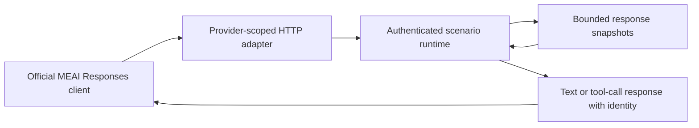

# Responses continuation

OpenAI, Azure OpenAI and Microsoft Foundry Responses creation preserves stored response context when an
official SDK sends `previous_response_id` with only the new tool output or user input. Streaming and ordinary
responses return the same runtime-owned response identity. Image/file input remains in normalized messages.

The provider-neutral runtime stores independent ordered snapshots of input plus assistant output/tool calls.
History is isolated by exact provider namespace, model and a hash of the supplied credential. New request
instructions replace earlier system/developer instructions, as required by the
[OpenAI Responses contract](https://developers.openai.com/api/docs/guides/migrate-to-responses) and
[Azure Responses contract](https://learn.microsoft.com/en-us/rest/api/aifoundry/azureopenai/responses).

`store=false` generates a response without retaining it. Unknown, foreign or reset parent identities return 404
before consuming a fixture. Reset and reconfiguration clear history. OpenRouter retains its documented stateless
behavior and rejects `store=true` or a non-null previous identity. Retrieval/deletion endpoints are outside this
creation/continuation contract.

Configuration owns `MaxStoredChatResponses` (default 256) and `MaxStoredChatResponseBytes` (default 16 MiB).
`WithChatResponseCapacity` and the client builder's `UseChatResponseCapacity` configure the same values.
Zero disables storage; negative values fail configuration validation. Capacity overflow returns 409 without
evicting history or consuming the configured response. Payload bytes plus per-record overhead bound retention.

Acceptance:

1. An ordinary or streamed official SDK tool loop reaches its scripted final response and the runtime journal
   contains the original text/image input plus the actual tool result (`LlmTckResponsesContinuationTests`).
2. Another provider, model or credential cannot read a parent; reset/configure invalidates every parent
   (`LlmTckChatHistoryTests`).
3. Stored input snapshots survive caller mutation and do not carry old instructions into a new request
   (`LlmTckChatHistoryTests`).
4. Disabled/full count or byte capacity fails visibly without consuming a fixture; `store=false` remains
   stateless (`LlmTckChatHistoryTests`, existing OpenRouter provider regressions).
